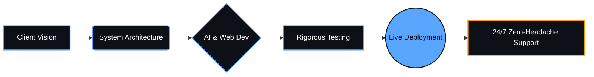

<div align="center">
  
</div>

<h1 align="center">VYOMARC Technologies</h1>
<h3 align="center">Engineering Scalable Digital Ecosystems for the Modern Business</h3>

<p align="center">
  <a href="https://www.linkedin.com/company/vyomarc-technologies/"></a>
  <a href="https://www.vyomarctech.com/"></a>
  <a href="mailto:vyomarctechnologies@gmail.com"></a>
  <a href="https://www.instagram.com/vyomarc.tech/"></a>
  <a href="https://x.com/vyomarc"></a>
</p>

---

## 🏆 Why VYOMARC Technologies?

<p align="center">
  
</p>

> **"We don't just write code; we engineer business growth."**
> In a market saturated with "design studios," **VYOMARC Technologies** stands out as a precision-driven software engineering firm. We don't just build websites; we build **Revenue Generating Digital Assets.**

*  📈 **Real-Market Proven:** Our solutions are battle-tested to perform under high-traffic and complex business demands.
*  🎢 **Zero-Headache Automation:** We shift the burden of digital maintenance from your shoulders to our expert teams.
*  🔐 **Security-First Architecture:** We build scalable, impenetrable systems that prioritize your business data.
*  🛍 **Business-Centric Engineering:** Our code isn't just syntax; it's a strategic tool built to improve your ROI, lead conversion, and operational efficiency.
- 🏢 **Currently building:** Next-generation automation systems for SMEs, Educational Institutes, and Enterprises.
- 💡 **Core Philosophy:** Security, Scalability, and Seamless User Experience.
- 🤝 **Open for:** High-ticket IT consulting, custom software development, and strategic tech partnerships.

---

## ⚙️ Our Premium Services

At VYOMARC, we provide end-to-end digital infrastructure. 

| Service | Description |
| :--- | :--- |
| 🌐 **Scalable Web Development** | High-performance, secure, and fully customized web platforms tailored for business growth. |
| 📱 **Android App Development** | Native and cross-platform mobile applications designed for a flawless user experience. |
| ☁️ **Micro SaaS Development** | Building specialized, subscription-based software solutions to solve niche business problems. |
| 🤖 **AI Automation** | Intelligent automation systems (like WhatsApp bots & workflows) to reduce operational overhead. |
| 📈 **SEO & Branding** | Data-driven search engine optimization and corporate identity positioning for maximum visibility. |
| 🛒 **E-Commerce Web Platforms** | Robust, conversion-optimized digital storefronts with secure payment gateways and inventory management. |

---

## 💎 Flagship Products & Dashboards

We engineer powerful internal tools and SaaS products designed to streamline complex operations:

*   🎓 **FeeDesk (Fee Management System):** A comprehensive financial tracking and management engine for educational institutions.
*   📝 **CBT Platform (Computer-Based Testing):** A highly secure, scalable examination platform with real-time analytics.
*   📊 **Smart Admin Dashboard:** Centralized command centers for businesses to monitor analytics, operations, and user data in real-time.
*   🏫 **Admission System Dashboard:** An automated lead-capture and direct-admission pipeline designed to eliminate manual data entry.

---

## 🛠️ Tech Stack & Engineering Arsenal

*Our robust technology stack empowers us to build scalable and secure applications.*

<p align="center">
  
</p>

---

---

## 💬 Client Success (Testimonials)
⭐️⭐️⭐️⭐️⭐️ *“I run a local grocery shop and wanted to start taking online orders without losing money to big delivery apps. The team at VYOMARC Technologies set up a clean, fast website for us featuring our 50 most popular items. What really changed the game is the WhatsApp ordering system they integrated. Customers just browse the site or scan the QR Code, and the final order drops right into our shop's WhatsApp. It is incredibly simple for my staff to manage, and our customers actually prefer it over downloading another app. Fantastic website development and automation service for small businesses in Patna and Bihar..”* 

⭐️⭐️⭐️⭐️⭐️ *“They have developed a remarkably fast and user-friendly custom software solution to manage our daily operations and data. I am not technical guy, yet their system is incredibly easy to operate. The best software company for simplifying work!”*

⭐️⭐️⭐️⭐️⭐️ *“​I wanted a clean website for my work but had absolutely zero clues about how it all works or what are domain and hosting. VYOMARC Technologies handled everything so patiently, explained things in simple words, and built a beautiful site that looks great on mobile phones. If you want a smooth, stress-free experience, they are definitely the best software company in Bihar to get your website made.”*

---


## 🛡️ The VYOMARC Standard

<p align="center">
  
  
  
  
</p>

## ⚙️ Our Engineering Pipeline


---
### 💻 System Configuration: vyomarc.exe

```json
{
  "company": "VYOMARC Technologies",
  "founder": "Saurabh",
  "mission": "Automating business workflows for schools, restaurants, and startups.",
  "core_services": [
    "Scalable Web Development",
    "Direct WhatsApp Automation & Ordering",
    "Micro SaaS & Internal Dashboards",
    "Local SEO & Digital Brand Positioning"
  ],
  "technologies": ["React", "Node.js", "AI Integration", "Next.js"],
  "current_status": "Building Revenue-Generating Digital Assets",
  "contact": "Ready for high-ticket IT consulting"
}
```

## 📈 Proven Business Impact (Case Studies)

<details>
  <summary><b>🏫 Smart School Digital Admission System</b></summary>
  <br>
  Built a highly secure, automated web platform for educational institutes. We eliminated manual data entry by integrating a seamless direct-to-WhatsApp admission inquiry system. Top-tier web development for schools seeking digital transformation.
</details>

<details>
  <summary><b>🍽️ Restaurant Real-Time Ordering System</b></summary>
  <br>
  Engineered a custom online ordering web application for local dining businesses. By setting up direct WhatsApp booking setups, we helped restaurants bypass heavy third-party app commissions, increasing their direct ROI.
</details>

<details>
  <summary><b>✈️ Premium Travel Agency Portals</b></summary>
  <br>
  Designed SEO-optimized, highly scalable booking platforms for tour operators. Structured multi-page architectures focused on lead generation and high-ticket customer conversion.
</details>

## 🎯 Target Markets & Solutions

<p align="left">
  
  
  
  
</p>


## 👨‍💻 About The Founder

<p align="center">
  
</p>

I am **Saurabh**, the architect behind VYOMARC Technologies. My approach is simple: **Build technology that solves problems, not just software that consumes resources.** With a deep focus on industrial-grade software engineering, I lead a team dedicated to turning complex operational challenges into streamlined, automated digital solutions.

<p align="center">
  <a href="https://www.linkedin.com/in/mrsaurabh009/"></a>
  <a href="https://x.com/mrsaurabh009"></a>
</p>

<p align="center">
  
</p>
